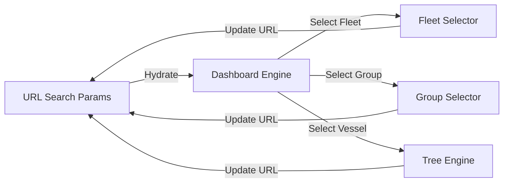
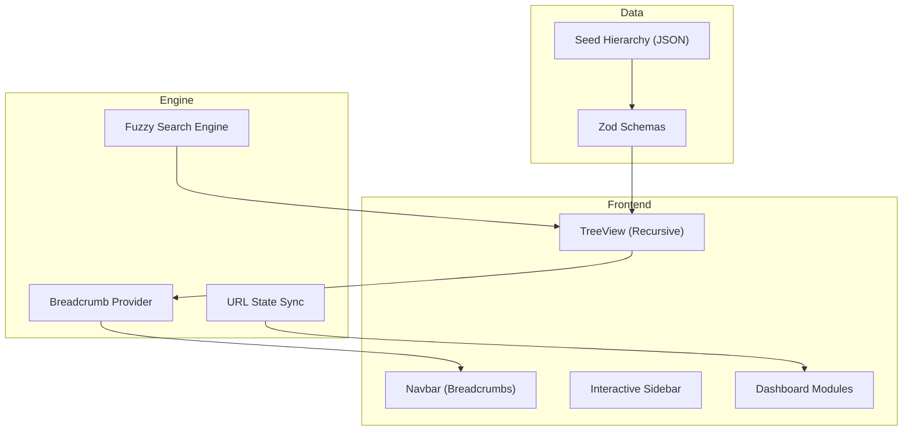

# 🚢 Keel Tree

### **Vessel Hierarchy Intelligence & Maritime Engineering Visualization**

Keel Tree is a state-of-the-art visualization platform engineered for the modern maritime industry. It transforms massive, multi-layered vessel equipment data into a performant, interactive "Keel-to-Mast" digital twin, allowing technical managers and engineers to navigate complex ship hierarchies with unprecedented clarity.

---

## 🌿 The Experience: Fluid & Precise

Most industrial software is a "grey box" of complexity. **Keel Tree** is built on the philosophy that **clarity is a competitive advantage.**


### 🌊 Sensory UX

- **Frictionless Navigation**: Physics-based animations ensure every expansion, search, and transition feels natural and expensive.
- **Glassmorphic Depth**: Layers of blurred transparency give the interface a world-class, premium feel while maintaining a technical focus.
- **Micro-Interactions**: Hover states, interactive breadcrumbs, and real-time shadows provide constant positive feedback.

---

## ⚡ Engineering Excellence

Keel Tree is more than a UI; it's a demonstration of high-performance web engineering.

### 1. Robust URL-Driven Navigation Flow

Selection state (Fleet → Division → Vessel) is entirely persisted in the URL. This enables:

- **Zero-Bugs Refresh**: Hard refreshes always return you to the exact node.
- **Browser Native Navigation**: Full "Back" and "Forward" support for hierarchy traversal.
- **Deep-Linking**: Direct URLs to specific equipment subgroups for instant sharing.



### 2. Recursive Visualization Engine

Built with custom logic for staggering reveals and path preservation.

- **Atomic Components**: Nodes are purely reactive and memoized for 60fps performance on large data sets.
- **Context-Aware Search**: Automatically expands all parent paths to ensure the search result is never "orphaned."


---

## 🛠 Tech Stack

- **Next.js 15+**: App Router for optimized SSR/SSG and client-side steering.
- **TypeScript**: Strict architecture with Zod-validated data schemas.
- **Framer Motion**: Production-grade layout animations.
- **Tailwind CSS 4.0**: Atomic design tokens for categorical node colors.

---

## 📐 System Architecture




---

## 🚀 Deployment & Installation

### 1. Clone & Install

```bash
git clone https://github.com/your-username/keeltree.git
cd keeltree
npm install
```

### 2. Launch Development

```bash
npm run dev
```

### 3. Production Build

```bash
npm run build
npm start
```

---

## ⚓ The Promise

> "The foundation of a great ship is its keel. The foundation of a great technical operation is its data. Keel Tree brings them together."

**Optimized for high-stakes environments where every component counts.**
